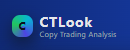
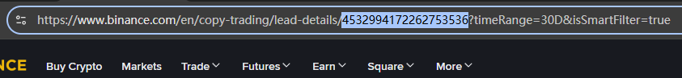
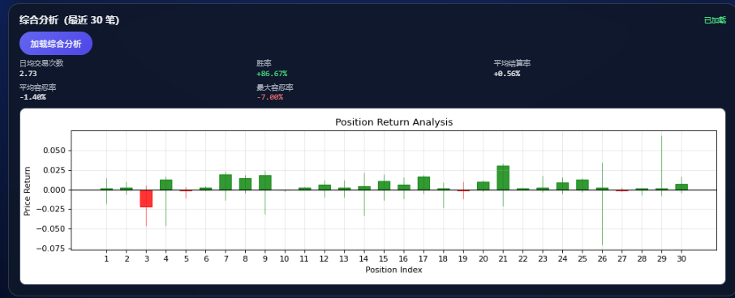
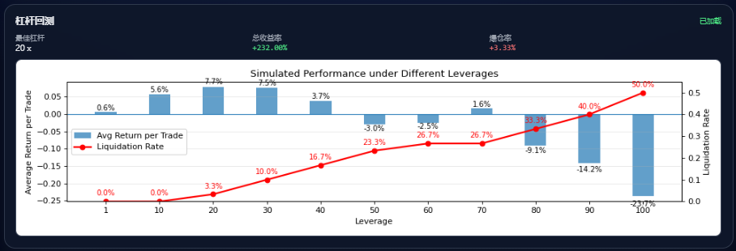
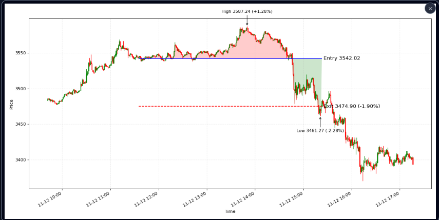
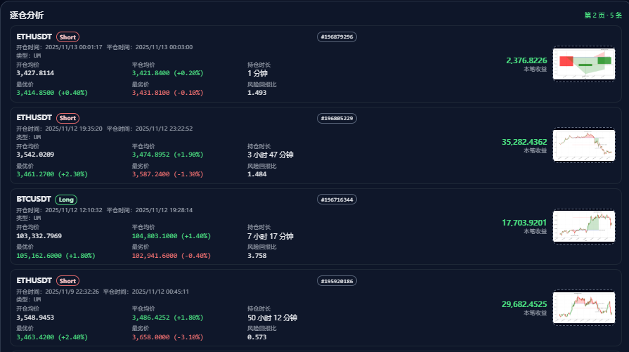

 
## 币安跟单交易员评测
基于K线历史回看持仓表现

评测入口：www.ctlook.cn

联系邮箱：lazyer.trading@gmail.com

telegram: @lazyer_trading

### 教程
1. 获取交易员ID

2. 综合分析
回看历史多笔交易，检查是否存在扛单行为

3. 杠杆回测
以不同的杠杆模拟等额跟单，计算收益率/爆仓率，以及测算最优杠杆/收益率

4. 逐仓分析
从历史k线视角观测持仓过程

